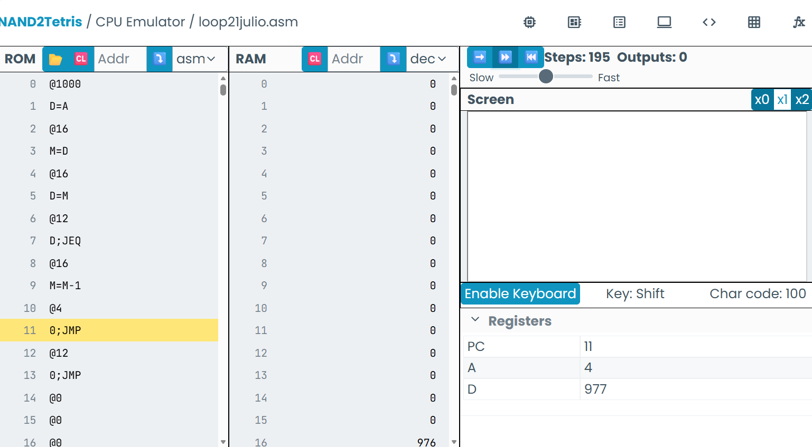
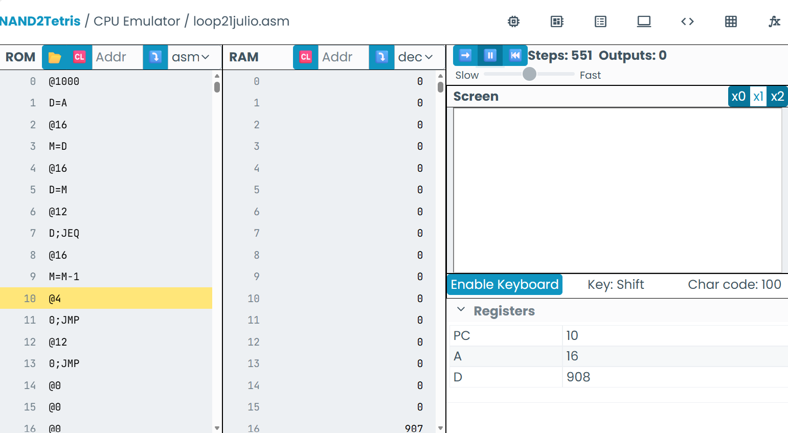

```asm
//Variables y etiquetas
@1
D=A
@2
D=D+A
@16
M=D
```

```
//Ejercicio
@5

@10

//variables
//var = 15
//i = 10
//D = i - var
//if D > 0 goto 20
//else goto 30
@15
D=A
@var
M=D //Igualamos la variable a 15
@10
D=A
@i
M=D //igualamos la variable i a 10
@i
D=M
@var
D=D-M //restamos las variables
@20 //decir la constante que será la posición
Di JGT
@30
0;JMP
```
```
//
@1000
D=A
@i
M=D
(100P)
@i
D=M
@CONT
D;JEQ
@i
M=M-1
0;JMP
``

