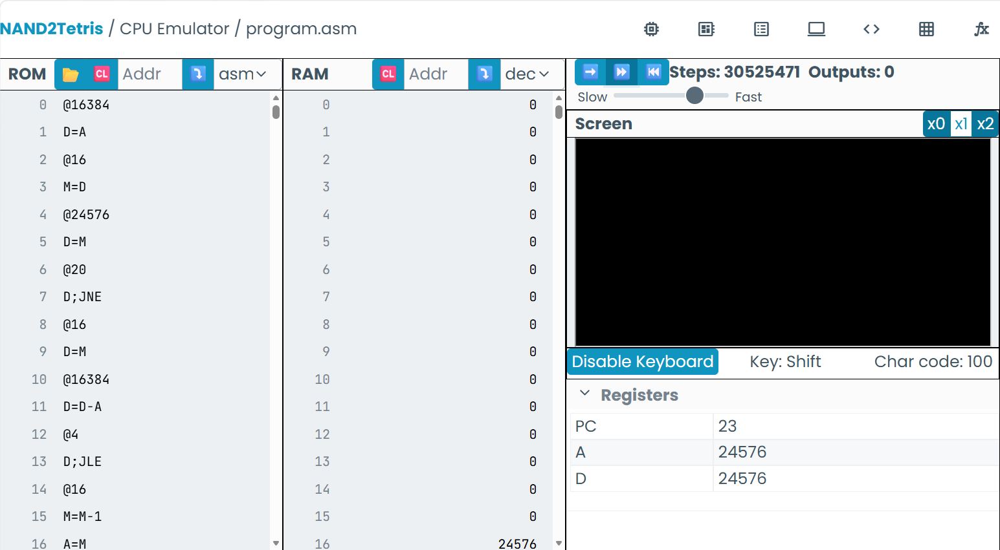

# predicción del programa

En el programa, identificamos varios patrones en el codigo, por ejemplo, cuando llamamos al screen, el emulador lo traduce a buscar la posicion de la pantalla, lo mismo aplica cuando llamamos al teclado, por ende se guardan posiciones en la RAM, sin embargo dudo que pase algo ya que en la pantalla monocromatica solo se ven valores de 1 y 0, sin embargo, guardan las posiciones de igual manera.
Por otro lado, al llamar el teclado, se busca identificar si hay alguna tecla presionada
