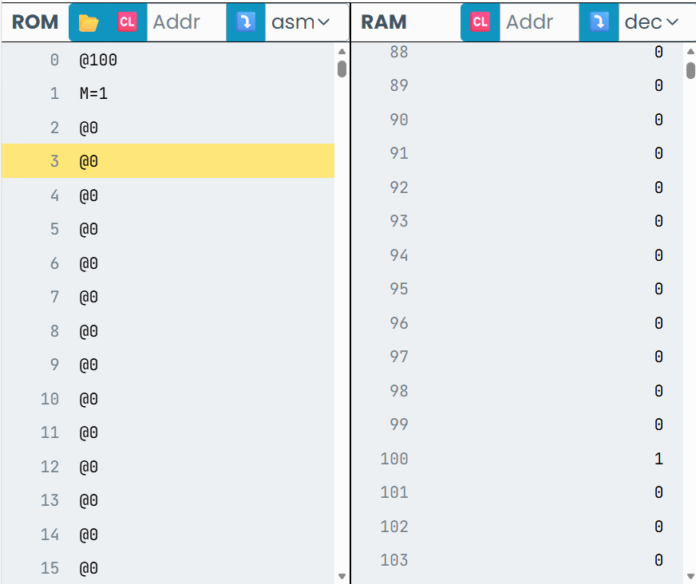
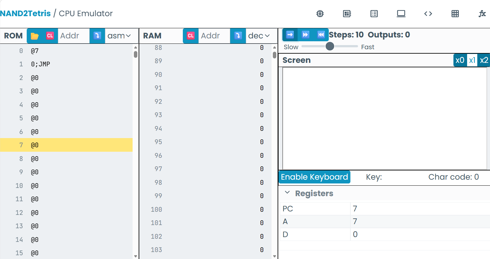

# Glosario
 # ROM: Read-Only Memory
   Funcionalidad:
     Lee únicamente las instrucciones de la memoria
     también se guarda en la variable A al ser recibida, y lee de la memoria la instrucción actual
 # RAM: Random Access Memory
   Funcionalidad:
    Lee y escribe los datos de la memoria que se conoce como A, y luego cuando se guarda en la memoria RAM se muestra como M

# Variables dentro del emulador
Teniendo en cuenta que las líneas de código están puestas bajo el lenguaje ASM, pero el emulador también es usado en binario, hexadecimal y dec
```
A: address register
M: selected RAM register
D: data register
```
# Ejemplo 1
Si utilizamos en una línea de código el @19, quiere decir que la variable A está siendo igualada a 19.
# Nota 
Al igualar números, debemos tener cuidado, ya que la única manera de que el emulador reciba un número aparte de 1 y -1, es llamando una constante, que queda en la variable A
# Ejemplo 2
Cuando llamamos una constante y luego llamamos la variable M, es porque estamos buscando la posición de la RAM
```
@100 //la posición 100 de la RAM
M=1 //La posición 100 de la RAM está siendo igualada a 1
```
viendose así:

donde puedes ver que la posición 100 de la RAM está siendo igualada a 1
# Ejemplo 3
En este ejercicio se pide poner el número 17 en la posición 100 de la RAM
```
@17 //Se llama la constante que queremos poner, al solo llamarla ya se encuentra en A
D=A //Se le pide al ROM que guarde la información de A en la memoria
@100 //Se llama la posición de la RAM que queremos utilizar
M=D //Se iguala el dato guardado en D en la posición que le dimos a M, en este caso 100

```
# Saltar posiciones
Al llamar a una constante y luego utilizar la línea de código 0;JMP, significa que estamos saltando a esa posición 
```
@7
0;JMP //esta línea de código está en la posición 2, pero, al utilizarla salta automáticamente a la posición 7
```

Tener en cuenta que este se utiliza para instrucciones sin condicional

# Condicionales
Los condicionales son utilizados para saltar a otras líneas de código siempre y cuando se cumpla una instrucción que le pongamos, la sintaxis de este es D;JGT
# Ejemplo 1
```
@6
D;JGT //Aquí la condición está diciendo que si D es mayor que 0, entonces se vaya a la posición 6
```
```
D;JGT = D mayor que 0
D;JGE = D mayor ó igual que 0
D;JLT = D menor que 0
D;JLE = D menor o igual que 0
D;JEQ = D igual a 0
D;JNE = D diferente de 0
```
# Nota
Toda esta información está guardada en la ROM
LOOP: Esto es lo que se le conoce como ciclos en la programación
```
@1000
D=A //Se guarda en la memoria la constante de la línea de código anterior
@i
M=D
```
KEYBOARD:
KEYPRESSED:
CONT:
PUNT:
i:
SCREEN:
